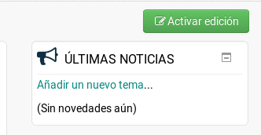

[<< back](README.md)

# Videoconferencias

Uso de la herramienta de videoconferencias **Blackboard Collaborate Ultra**.

1. [Crear videoconferencia](#crear)
2. [Crear sesiones](#crear-sesiones)

## Crear

* Entrar en la plataforma Moodle [Campus Virtual](http://www3.gobiernodecanarias.org/medusa/eforma/campus/).
* Entrar en un curso.
* `Administración -> Activar Edición`

* `Añadir actividad o recurso`
* Elegir `Actividad Externa`.
* Rellenar formulario con:
    * Nombre: `Videoconferencia`
    * Tipo de herramienta externa: `Blackboard Collaborate Ultra`
* `Guardar cambios`

Ya tenemos creada la videoconferencia.

## 2. Crear sesiones

* Entrar en videoconferencia.
* Crear sesión.
* Rellenar formulario con:
    * Nombre de la sesión
    * Fecha inicio/fin
    * Guardar
