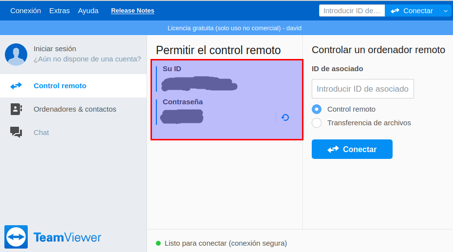

# Control remoto

Puede darse la situación de estar trabajando a distancia con un alumno o compañero,
cada uno desde su ordenador, y:
* querer explicarle cómo hacer algo en el ordenador
* hacer nosotros alguna acción concreta en el ordenador del alumno o
* ver cómo lo está haciendo el alumno.

En esto casos podemos usar herramientas de control remoto, de modo que desde nuestro
ordenador local podremos manejar el ordenador remoto.

## Teamviewer

TeamViewer es una herramienta para controlar un equipo remoto de forma puntual.
Lo primero que necesitamos es instalar TeamViewer en ambos equipos.

Instalación:
* Ir a la página web [TeamViewer](https://www.teamviewer.com/es/descarga/windows/)
* Descargar el programa según nuestro sistema operativo. Pulsar en `Windows` si
nuestro sistema operativo es Windows.
* Instalar el programa.

Iniciar el programa:
* Ir a `Menú -> TeamViewer` para iniciar el programa.
* A continuación veremos una ventana que nos muestra **ID** y **Contraseña**.

Cuando queremos que un alumno nos deje acceder a su PC:
* El alumno debe iniciar TeamViewer.
* El alumno nos debe pasar la información de su ID y contraseña.
* El profesor inicia TeamViewer.
* El profesor escribe la ID del alumno en "Introducir ID..." y pulsa el botón de `Conectar`.
* Cuando nos pida un clave, el profesor escribe la contraseña del alumno y se inicia el control de la máquina remota.
