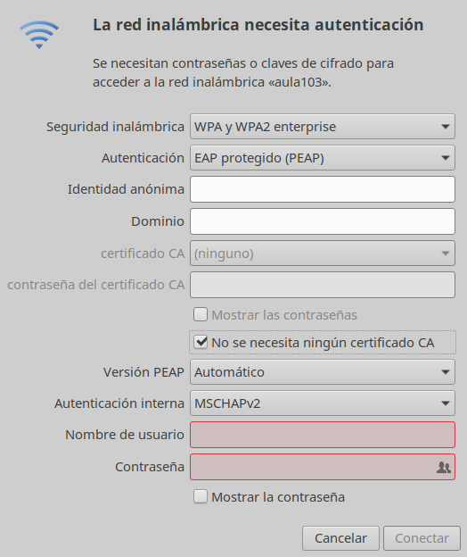

# Medusa

# Wifi Medusa

> La red Wifi Medusa es para uso de los profesores, mientras que la red Medusa-Educativa
la pueden usar profesores y alumnos.

Para configurar la conexión Wifi de Medusa en GNU/Linux hay usar los siguientes valores:

| Parámetro               | Valor                   |
| ----------------------- | ----------------------- |
| Seguridad               | WPA2 Enterprise         |
| Autenticación           | EAP (Protegido PEAP)    |
| Se necesita certificado | NO                      |
| Autenticación interna   | EAP-MSCHAP-v2           |
| Usuario                 | Usuario de Pincel/Ekade |
| Contraseña              | Clave de Pincel/Ekade   |

