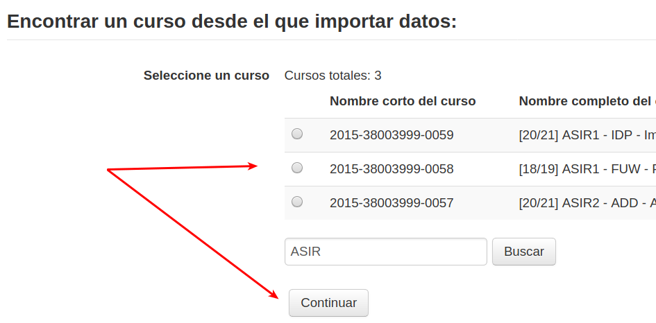

[<< back](README.md)

# Moodle

Moodle es una plataforma de eLearning o de apoyo a la enseñanza. La Consejería proporciona
dos plataformas Moodle, y la que nosotros vamos a usar se llama **Campus Virtual**.

Esta guía se irá modificando y ampliando a medida que avance el curso.

Alumnos:
* [Entrar en la plataforma](#entrar-en-la-plataforma)
* [Entrar en una videoconferencia](#entrar-en-una-videoconferencia)
* [Entregar tarea](#entregar-tarea)

Profesores:
* [Crear nuevos cursos](#crear-nuevos-cursos)
* [Crear videoconferencia](#crear-videoconferencia)
* [Matricular al alumnado](#matricular-al-alumnado)
* [Agrupamientos](#agrupamientos)
* [Copiar](#copiar)
* [Foro novedades](#foro-novedades)

---

# Alumnos

## Entrar en la plataforma

Para entrar a la plataforma Moodle hacemos lo siguiente:
* Abrir un navegador Web (Preferiblemente Firefox).
* Ir a la siguiente [página web](http://www3.gobiernodecanarias.org/medusa/eforma/campus/). Otra forma de acceder al Campus Virtual es ir a la `página web del centro -> Alumnado -> Campus Virtual`.

* Accederemos con nuestro usuario/clave de Pincel Ekade.

* Una vez dentro vemos un listado con las asignaturas/módulos en los que estamos participando.
* Pulsando en el nombre de cada asignatura entraremos en la página principal, donde veremos
sus contenidos, actividades, foros, salas de videoconferencia, etc.
* Para salir, recordar que siempre debemos cerrar la sesión. Para ello vamos a
la esquina superior derecha y donde aparece nuestro nombre hay un desplegable que nos
ofrece la opción `salir`.

## Entrar en una videoconferencia

Para acceder a las sesiones online de nuestra asignatura haremos lo siguiente:
* Entrar en la plataforma Moodle [Campus Virtual](http://www3.gobiernodecanarias.org/medusa/eforma/campus/).
* Entrar en nuestro curso (asignatura) de Moodle.
* Pulsar en la sala de videoconferencia.
* Unirse a la sesión que haya creado el profesor.

## Entregar tarea

Para entregar una tarea:
* Entramos en Campus.
* Entramos dentro del curso correspondiente a la asignatura.
* Buscamos la tarea (Una imagen de una mano entregando un papel), y pulsamos.

* Pulsamos en el botón `Agregar entrega`.
* Arrastramos los archivos que vamos a entregar dentro del recuadro blanco.
* Pulsamos `Guardar cambios` para terminar.

---

# Profesores

## Crear nuevos cursos

Para crear un nuevo curso Moodle para nuestra asignatura/módulo hacemos lo siguiente:
* Entrar en la plataforma [Moodle](http://www3.gobiernodecanarias.org/medusa/eforma/campus/)
* En la esquina superior derecha, donde aparece nuestro nombre hay un desplegable
que nos permite ir a la [consola de servicios](https://www3.gobiernodecanarias.org/educacion/cau_ce/servicios/mis-servicios/aula-virtual-campus/menu-principal#forward).
* `Crear aulas virtuales`
* Elegir el número de aulas que queremos crear.
* Escribir el nombre del aula de la siguiente forma: `[20/21] ASIR1 - IDP - Implantación de sistemas operativos`. Primero curso actual, nivel educativo, código de la materia, nombre de la materia.
* `Siguiente`
* Aceptar los términos de las condiciones y `siguiente`.
* `Enviar solicitud`

Si nos hemos equivocado con el nombre del aula o queremos eliminarla:
* Ir a la consola de servicios.
* `Gestionar las aulas virtuales`
* Marcamos el aula que queremos modificar/eliminar.
    * Pulsar `Nombre` para cambiar el nombre del aula.
    * Pulsar `Borrar Aula` para eliminar el aula.
* Se nos pide confirmación.
* `Enviar solicitud`

## Crear videoconferencia

Campus nos permite crear salas de videoconferencia para compartir sesiones online
con nuestro grupo-clase. Los pasos a seguir son los siguientes:

1. El profesor crea la sala de videoconferencia dentro del curso Moodle.
2. El profesor crea las sesiones y comunica a los alumnos cuando se deben conectar a la sala.
3. Profesor y alumnos entrar a la videoconferencia.

**Crear la sala de videoconferencia**

> Esto lo hace el profesor

* Entrar en la plataforma Moodle [Campus Virtual](http://www3.gobiernodecanarias.org/medusa/eforma/campus/).
* Entrar en nuestro curso de Moodle.
* `Administración -> Activar Edición`

* `Añadir actividad o recurso`
* Elegir `Actividad Externa`.
* Rellenar formulario con:
    * Nombre: `Videoconferencia`
    * Tipo de herramienta externa: `Blackboard Collaborate Ultra`
* `Guardar cambios`

Ya tenemos creada la videoconferencia.

**Crear sesiones**

> Esto lo hace el profesor

Podemos crear una sesión que dure todo el curso, o bien crear sesiones el
día y hora que tengamos planificado hacer una reunión online con nuestro grupo.
* Entrar en la sala de videoconferencia.
* Crear sesión.
* Rellenar formulario con:
    * Nombre de la sesión
    * Fecha inicio/fin
    * Guardar

## Matricular al alumnado

> En el caso,de que no aparezcan datos de alumnos, tendremos que esperar a que termine el proceso de matrículación en Secretaría, y se hay cargado la información desde Pincel Ekade.

Para matricular a nuestro alumando y que tenga acceso a nuestro curso Moodle hacemos lo siguiente:
* Entrar en la plataforma [Moodle](http://www3.gobiernodecanarias.org/medusa/eforma/campus/)
* En la esquina superior derecha, donde aparece nuestro nombre hay un desplegable
que nos permite ir a la [consola de servicios](https://www3.gobiernodecanarias.org/educacion/cau_ce/servicios/mis-servicios/aula-virtual-campus/menu-principal#forward).
* `Gestionar las matrículas de las aulas virtuales`
* Seleccionamos nuestra aula virtual y `Siguiente`.
* Pulsamos en `+ Alta usuario/a`.
* Elegimos `Alumnado`.
* Seleccionamos nuestro grupo para aplicar un filtrado.

* Seleccionamos todos los alumnos que aparecen como resultado de aplicar filtro. Deben corresponder con los alumnos de nuestro grupo.

> Revisar que los datos son correctos. Lo alumnos sin cuenta de correo en Pincel Ekade
no se podrán matricular en Campus hasta que no se complete la información. Por ello, cada tutor debe hacer un listado con los fallos a corregir: nombre de alumno y correo para corregirlos.

Y solicitar las correcciones en Pincel Ekade enviando un email a `administracion@iespuertodelacruz.es`.

* `Aceptar`
* `Enviar solicitud`

## Agrupamientos

Los agrupamientos sirven para crear grupos dentro de un mismo curso de Campus (Moodle).
Por ejemplo si impartimos una materia de igual forma en el A y el B. Podríamos crear un
único curso Moodle para la materia y dentro podemos (si lo consideramos conveniente) separar
a los alumnos en grupos separados.

Veamos el proceso para crear agrupamientos:
* Los alumnos deben estar ya matriculados en nuestro curso.
* Ir a `Administración -> Usuarios -> Grupos`.
* Ir a `Crear Grupo`, para crear "grupo A" y "grupo B" (Por ejemplo).

* Seleccionar un grupo.
* Ir a `Agregar/quitar usuarios` para asignar los usuarios que correspondan.

Podemos usar los agrupamientos para mantener las actividades separadas y también para crear restricciones. Por ejemplo, si queremos tenemos 2 salas de video conferencia separadas para cada grupo. Haremos lo siguiente:

* `Activar edicíón`
* Ir a `Editar ajustes` de la videoconferencia.
* En la sección de **Restricciones de acceso**, crearemos un a restricción para permitir el acceso a uno de los grupos.

> En general, usaremos la configuración de restricciones cuando queremos limitar el acceso a alguno de los elementos de nuestro curso Moodle.

## Copiar

Hay varias herramientas para copiar en Moodle. La función de `importar` sirve para
copiar en nuestro curso actual, trozos o partes de otro de nuestros cursos. Veamos los pasos:

* Entrar en Moodle y vamos al curso destino. Esto es donde queremos copiar elementos.
* Ir a `Administración -> Importar`

* Se nos muestra un listado con todos nuestros cursos para que elijamos el curso origen. Esto es, desde donde queremos copiar. Pulsamos `Siguiente`

* Ahora vemos un listado con todos los tipos de elementos que podemos copiar. Elegimos los que queremos o todos y `Siguiente`.

* A continuación vemos un listado detallado con todos los elementos que podemos copiar del curso origen a nuestro curso destino. Marcaremos todos los que queramos copiar. Pulsar `Realizar importación`.

## Foro Novedades

Por defecto, todos los cursos Moodle tienen un foro `Novedades`. Dicho foro está vinculado con el bloque `Últimas Noticias`, de modo que todos los mensajes publicados en el foro serán visibles también desde el bloque.

Por tanto, si queremos que el alumnado vea los mensajes en el bloque, entonces el foro debe estar también visible para los alumnos.
