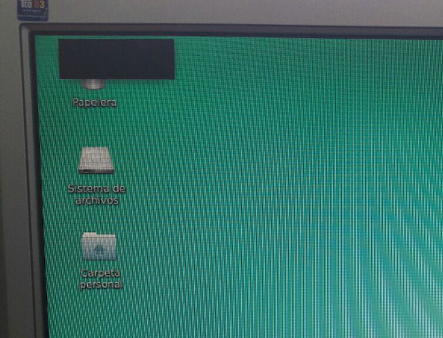

# Iniciar Xubuntu

Si al iniciar Xubuntu, nos aparece esta pregunta:

Elegir la opción por defecto y listo.

Si elegimos panel vacío, entonces veremos lo siguiente:

Si queremos volver hacia atrás... reiniciar equipo.
