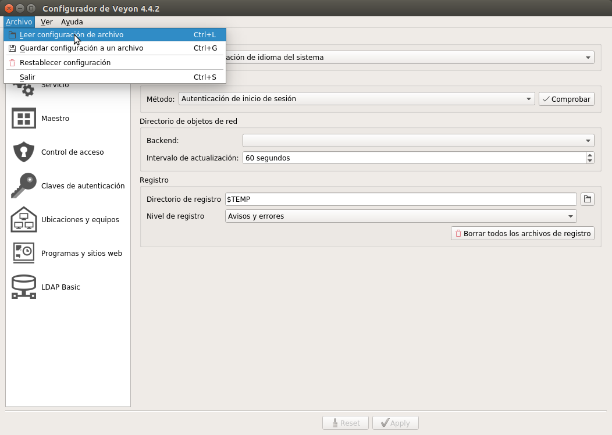
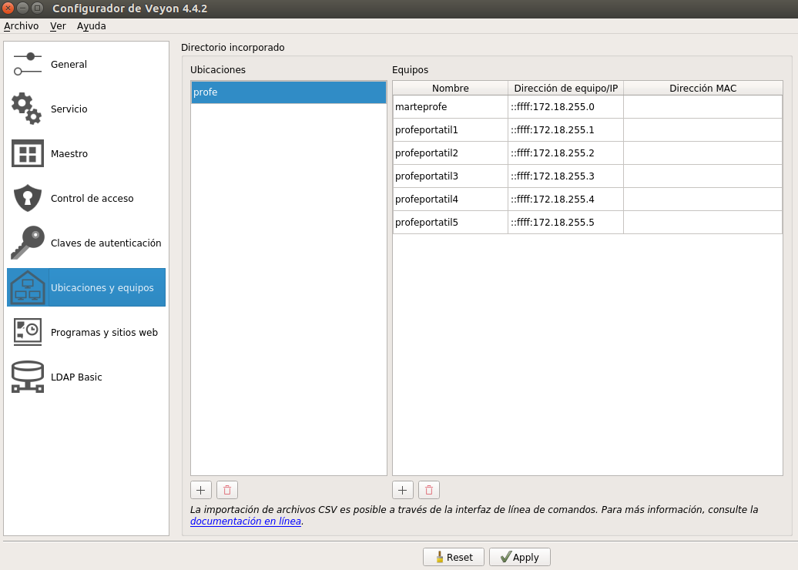

# VEYON: Software de monitorización

El software iTalc ya está descontinuado, se debe sustituir por veyon (https://veyon.io/).

## Instalación

* Descargar la versión adecuada para el sistema operativo (https://veyon.io/download/).
* Ejecutar instalador con el usuario "super" que tiene permisos de superusuario (sudores).
El proceso de instalación es igual para el máster y los clientes.

> NOTA: Da un aviso en una firma errónea durante el proceso.

## Configurar el MASTER

**Crear nueva configuración**

La configuración del MASTER es la que debe tener el equipo del profesor:
* Entrar en el "Veyon configurator" (se requieren permisos de administrador.
* Crear un grupo para toda la clase (p.ej aula109 o aula 103) en "Locations & computers".
* Añadir todos los equipos: nombre e IP. De esa forma es más fácil luego acceder a cada uno de ellos e incluso tenemos una panorámica de todas las pantallas y ver el contenido a la vez (se puede hacer zoom con Ctrl + rueda del ratón).
*  Para ver o acceder a los equipos remotos, tenemos que arrancar el `Educación -> Veyon Master` (pide usuario y contraseña del usuario local).
* Además de ver las pantallas, comprobamos que se puede tomar control del equipo y encenderlos si están apagados con WOL (Wake On LAN). Hay más posibilidades, como apagarlos, etc., pero en un intento inicial no funcionó y no lo probamos más a fondo.
* El modo de autenticación lo ponemos en "logon".

**Exportar el fichero de configuración**

* `veyon-cli config export veyon-master.json`.

**Importar un fichero de configuración existente**

Usando los comandos:
* Supongamos que tenemos el fichero de configuración "veyonmaster.json".
* `veyon-cli config import veyon-master.json`, este comando carga la configuración en Veyon.
* `veyon-cli service restart`, para reiniciar el servicio y leer los cambios. También valdría con reiniciar el equipo.

Usado el interfaz gráfica:
* Abrir "veyon-configurator"

* Una vez cargado el fichero hay que ejecutar el botón "aplicar" para realizar los cambios.
* Reiniciar el equipo.

## Configurar los CLIENTES

**Crear nueva configuración**

La configuración CLIENTE es la que deben tener los equipos de los alumnos:
* Entrar en el "Veyon configurator" (se requieren permisos de administrador).
* En "Locations & computers" creamos un grupo donde sólo está el ordenador del profesor (el master), indicando como IP la del master en formato :ffff::172.19.255.0.

* Añadir una regla para que SÓLO se puedan conectar desde el grupo profesor.
* Además, desactivamos todos los módulos para que no puedan conectarse a otros equipos (por seguridad redundante, porque realmente con las reglas ya no lo permite, pero por si acaso... ;)
* Recomendable reiniciar después.

**Exportar el fichero de configuración**

* `veyon-cli config export veyon-slave.json`

**Importar configuración desde fichero**

Usando comandos:
* Supongamos que el fichero de configuración es veyon-slave.json.
* `veyon-cli config import veyon-slave.json`
* `veyon-cli service restart`, para reiniciar el servicio y leer los cambios. También valdría con reiniciar el equipo.

Usando el interfaz gráfica:
* Supongamos que tenemos el fichero de configuración `veyon-slave.json`.
* Abrir el veyon configurator, mediante el menú `Educación -> Veyon configurator`. Si no se abre así es poeque se requiere usar un usuario con privilegios de administrador. También se puede abrir con `sudo veyon-configurator`.
* En el menú "File", escoger "load setting from file" (JSON) y cargar el fichero veyon.conf.

> WARNING: Ir a "Access Control" y eliminar la regla "profe2" (se quedó ahí por error, habría que quitarla del JSON que está en leela). Debe haber una ÚNICA regla que ponga "solo profe".

* Ir a "Locations & computers" y comprobar si el grupo "profe" tiene la IP correcta según se esté en la 109 o la 103 (cambiarla si no)
* Pulsar el botón "Apply" de abajo para salvar los cambios.
* Ir a "General" y arrancar el demonio (hay un botón con forma de "play")
* Reiniciar el equipo.

**Comprobación final**

Es conveniente luego entrar en los esclavos con usuarios sin privilegios (daw, asir, etc.) y abrir el "veyon master" para comprobar que está "capado" y que no pueden hacer nada.

## Usuario de conexión desde el equipo MASTER

"veyon-master" utiliza el usuario local (sesión abierta) para conectar con los equipos remotos.
No se ve opción para establecer un usuario/clave diferente para la conexión remota. Así que de momento, debe crearse el mismo usuario/contraseña tanto en el equipo master como en los clientes.

> Pero para inhabilitar accesos no deseados de ese usuario en mi equipo local le inhabilité la shell  (En /etc/passwd con: /bin/false, /dev/null,... )
